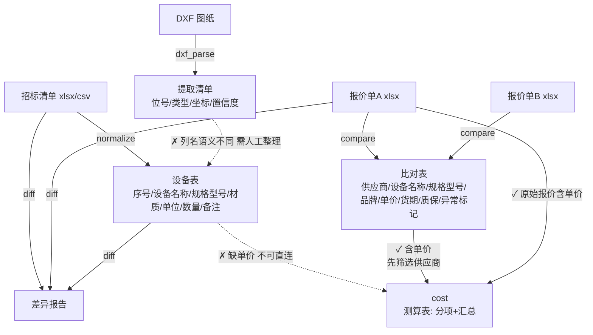

# 工具数据契约与数据流图

> 契约权威定义在 `scripts\quote_tools.py` 顶部 `TOOL_SCHEMAS`；本文件为文档化说明。
> 规则：工具入口统一做 schema 校验（字段缺失/类型错误/空数据），违反契约报"数据契约错误"而非底层异常。

## 一、各工具契约

### normalize（招标清单 → 设备表）

| | 字段 | 类型 | 单位 | 说明 |
|---|---|---|---|---|
| 输入 required | 名称 | 文本 | — | 别名：设备名称/设备/品名/项目/name/item |
| 输入 optional | 规格 / 材质 / 单位 / 数量 / 备注 | 文本/文本/文本/数值/文本 | — | 数量为数值（缺省按 1） |
| **输出** | 序号 / 设备名称 / 规格型号 / 材质 / 单位 / 数量 / 备注 | int/str/str/str/str/num/str | — | **无单价字段** |
| 输入格式 | xlsx / csv（utf-8-sig） | | | |

### compare（多报价 → 比对表）

| | 字段 | 类型 | 单位 | 说明 |
|---|---|---|---|---|
| 输入 required（每张表） | 名称、单价 | 文本、数值 | 元（人民币） | 单价别名：价格/报价/含税/成本/price |
| 输入 optional | 规格 / 品牌 / 货期 / 质保 | 文本 | 天/年 | |
| **输出** | 供应商 / 设备名称 / 规格型号 / 品牌 / 单价 / 货期 / 质保 / 来源文件 / 异常标记 | str/str/str/str/num/str/str/str/str | 元 | 同设备多供应商占多行 |

### cost（含单价表 → 测算表）

| | 字段 | 类型 | 单位 | 说明 |
|---|---|---|---|---|
| 输入 required | 单价 | 数值 | 元 | 缺失即报 `Missing required field: 单价` |
| 输入 optional | 数量 / 名称 / 规格 / 单位 | 数值/文本/文本/文本 | | 数量存在时必须全为数值 |
| **输出** | 分项 sheet：设备名称/规格型号/单位/数量/单价(未税)/小计；汇总 sheet：项目/金额 | | 元 | |
| 参数 | --tax(13%) --freight --install --admin --profit --allow-duplicates | 百分比/元 | | **--allow-duplicates**：默认同一设备（名称+规格）多行会报"重复条目…重复计价"契约错误（防 compare 输出直接计价导致重复），需显式放行 |

### diff（投标清单 vs 报价清单 → 差异报告）

| | 字段 | 类型 | 说明 |
|---|---|---|---|
| 输入 required（两张表） | 名称 | 文本 | |
| 输入 optional | 规格 / 数量 | 文本/数值 | |
| **输出** | 差异类型 / 条目 | str/str | 漏项/多出/数量差异 |

### dxf_parse（图纸 → 提取清单）

| | 字段 | 类型 | 说明 |
|---|---|---|---|
| 输入 | dxf 文件 | — | |
| **输出** | 位号 / 名称 / 类型 / 坐标X / 坐标Y / 图层 / 来源 / 置信度 / 复核标记 | str/str/str/num/num/str/str/num/str | 初稿需人工复核 |

## 二、工具间串联矩阵

| 上游 → 下游 | 可直接连接 | 原因 |
|---|---|---|
| normalize → cost | ✗ **不可** | normalize 输出无"单价"；cost 报 `Missing required field: 单价` |
| compare → cost | ✓ 可（默认带保护） | 比对表含单价；同设备多供应商占多行，**默认被重复键契约拒绝**（防重复计价），先筛选供应商或显式 `--allow-duplicates` |
| 报价单(原始) → cost | ✓ 可 | 原始报价表本身含单价与数量 |
| normalize → diff | ✓ 可 | 设备表含名称（+规格），可作为 diff 的任一输入 |
| compare → diff | ✓ 可 | 比对表含名称+规格 |
| dxf_parse → normalize / diff | ✗ **不可** | 列名与语义不同（位号 vs 设备名称、图纸清单 vs 招标清单），需人工整理 |
| cost → 其他 | ✗ | 终产物（测算表），无下游工具 |

## 三、数据流图

**关键结论**：`normalize` 与 `cost` 之间必须经过"人工询价填单价"或"compare 选商"两个中间环节之一，工具不再允许直接串联（入口校验直接拒绝并给出明确错误与建议）。
